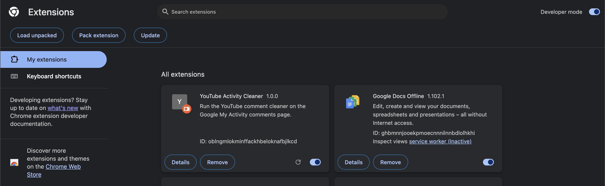
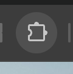
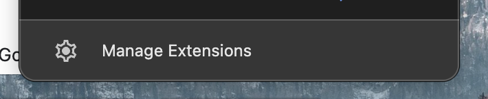
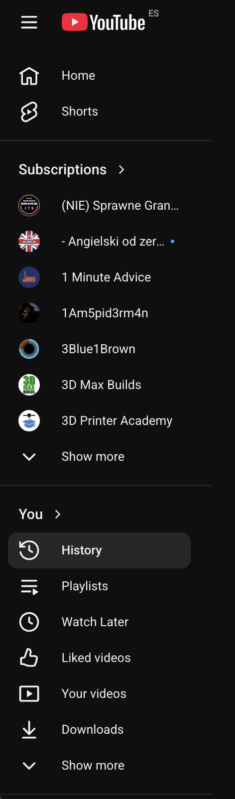
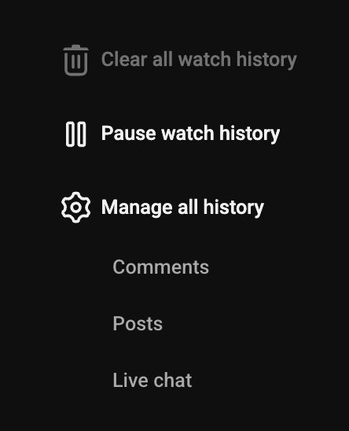
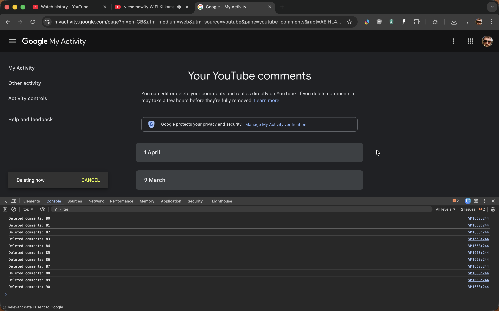
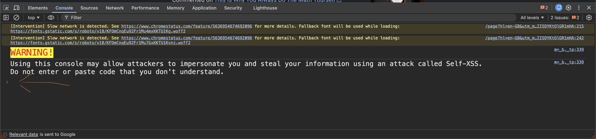

# YouTube Activity Cleaner

Delete YouTube comments, comment likes, and liked videos with a local-first cleaner.

Project site:

`https://michalmatu.github.io/youtube-activity-cleaner/`

You can use:

- the Chrome extension in [`extension/`](extension/) for the easiest flow
- the browser-console script in [yt-comment-cleaner.js](yt-comment-cleaner.js) if you do not want to install the extension

## Recommended: Chrome Extension

This is the easiest way to run the cleaner.

### Local tests

Run the lightweight unit tests with:

```bash
npm test
```

### Release helpers

Generate extension icons and Chrome Web Store assets:

```bash
npm run assets
```

Build a Chrome Web Store upload ZIP with `manifest.json` at the archive root:

```bash
npm run package
```

### Install

1. Open `chrome://extensions`
2. Turn on `Developer mode`
3. Click `Load unpacked`
4. Select [`extension/`](extension/)
5. Make sure `YouTube Activity Cleaner` appears in the list
6. After local code changes, click `Reload` on the extension card

<p align="center">
  
</p>

### Open the popup

If the extension icon is not pinned, click the Chrome `Extensions` button and open `YouTube Activity Cleaner`.

<p align="center">
  
  
</p>

### Run the cleaner

1. Open the extension popup
2. If needed, use one of the popup shortcuts to open the comments, comment likes, or liked videos page
3. Reopen the popup on that page
4. Wait for `Ready to start on the current tab.`
5. Open the collapsed `Settings` section only if you want a slower, safer, or more aggressive run
6. Click `Start`
7. Keep that Google My Activity tab visible while the cleaner is working
8. You can switch to another tab and still open the popup to monitor status or click `Stop`
9. Click `Stop` to stop the current run

Live counters:

- `Deleted`
- `Attempts` including retries
- `Failed`

Saved popup settings:

- run profile: `Fast` or `Safe`
- delay between comments
- wait after scrolling/loading more items
- retry count and retry backoff
- stop after a chosen number of failures in a row

These settings are stored locally in Chrome and reused on the next run.

The popup also includes a `Help & support` button and an optional `Buy me a coffee` button.

### Important

The extension enables Chrome keep-awake mode while it runs, which helps prevent display sleep and screen saver interruptions. The Google My Activity tab should still stay visible while the cleaner runs because Chrome throttles hidden tabs.

The current beta is best tested with the Google My Activity interface in `English` and `Polish`. Other interface languages may still work, but selector and status-text coverage is not as complete yet.

### Current V2 Status

The `v2` branch is currently in a `late beta / release prep` stage.

- core cleaner flow: done
- popup controls, counters, and settings: done
- localized popup UI: done for `English` and `Polish`
- automated lightweight tests: done
- manual smoke test on the live Google My Activity page: still recommended before release
- Chrome Web Store screenshots and release decisions: still open

Planning docs for the next steps:

- [`store/v2-launch-plan.md`](store/v2-launch-plan.md)
- [`store/manual-smoke-test.md`](store/manual-smoke-test.md)

## Chrome Web Store Prep

This repo now includes:

- GitHub Pages-ready site files in [`docs/`](docs/)
- Store listing drafts and reviewer notes in [`store/`](store/)
- Generated icons and promotional assets in [`store/assets/`](store/assets/)

Store asset TODO:

- replace generated/mock listing screenshots with final real captures from the live extension popup on `Google My Activity -> Your YouTube comments`

Recommended next step before publishing:

1. Run the manual checklist in [`store/manual-smoke-test.md`](store/manual-smoke-test.md)
2. Enable GitHub Pages from the `docs/` directory
3. Review the draft listing copy in [`store/chrome-web-store-listing.md`](store/chrome-web-store-listing.md)
4. Run `npm run package`
5. Upload the ZIP from `dist/` to the Chrome Web Store dashboard

### Support

Help and troubleshooting:

`https://michalmatu.github.io/youtube-activity-cleaner/support.html`

Optional support for the project:

`https://buymeacoffee.com/michalmatuh`

## Console Method

Use this if you do not want to install the extension.

### Quick Flow

1. Open `YouTube -> History -> Manage all history`
2. Open `Comments`
3. Open the browser `Console`
4. Paste [yt-comment-cleaner.js](yt-comment-cleaner.js)
5. Press Enter
6. Stop later with `stopYtCommentCleaner()`

## Step-By-Step Guide

### 1. Open the comments page

Open YouTube `History`, then click `Manage all history`.

<p align="center">
  
  
</p>

Then open the `Comments` section in Google My Activity.

Shortcut:

`https://myactivity.google.com/page?hl=en-GB&utm_medium=web&utm_source=youtube&page=youtube_comments`



### 2. Open the browser console

Open Developer Tools and switch to the `Console` tab.

Shortcuts:

- macOS: `Option + Command + J`
- Windows / Linux: `Ctrl + Shift + J`
- Alternative: `F12`, then open `Console`

If that does not work, right-click the page and choose `Inspect`.

### 3. Copy the script

Open [yt-comment-cleaner.js](yt-comment-cleaner.js) and copy the whole file.

Keyboard shortcuts:

- macOS: `Command + A`, then `Command + C`
- Windows / Linux: `Ctrl + A`, then `Ctrl + C`

The source of truth for the console version is this file only:

- [yt-comment-cleaner.js](yt-comment-cleaner.js)

The top of the file tells you exactly what to copy and where to paste it.

### 4. Paste and run

Click inside the console, paste the full script, and press Enter.



If Chrome blocks pasting, type:

```js
allow pasting
```

and press Enter first. Then paste the script again.

### 5. Let it run

The script deletes visible comments, waits for each item to disappear, and scrolls automatically.

While it runs, the console prints progress like:

```js
Deleted comments: 1
Deleted comments: 2
Deleted comments: 3
```

When it finishes, it prints:

```js
Finished. Deleted: X, attempts: Y, failed: Z
```

### 6. Stop the script

If you want to stop it while it is running, run:

```js
stopYtCommentCleaner()
```

## Notes

- This is a UI automation script, not an official YouTube bulk-delete feature.
- Google can change the page layout at any time, which may break selectors.
- It is a good idea to test the script on a few comments first.
- Google may take some time to fully reflect deletions after they are triggered.
- The extension currently supports comments, comment likes, and liked videos.
