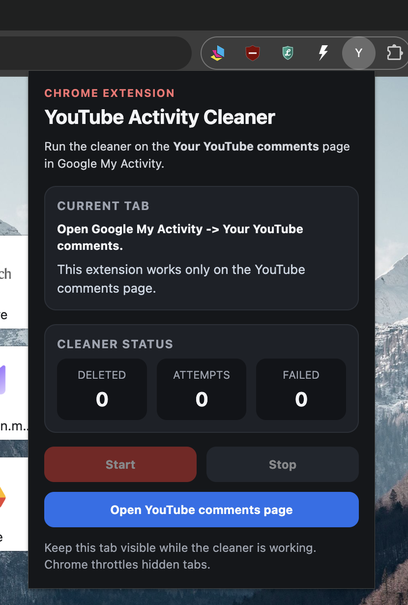

# YouTube Activity Cleaner

Delete your YouTube comments from Google My Activity.

You can use:

- the Chrome extension in [`extension/`](extension/) for the easiest flow
- the browser-console script in [yt-comment-cleaner.js](yt-comment-cleaner.js) if you do not want to install the extension

## Recommended: Chrome Extension

This is the easiest way to run the cleaner.

### Install

1. Open `chrome://extensions`
2. Turn on `Developer mode`
3. Click `Load unpacked`
4. Select [`extension/`](extension/)
5. Make sure `YouTube Activity Cleaner` appears in the list

<p align="center">
  
</p>

### Open the popup

If the extension icon is not pinned, click the Chrome `Extensions` button and open `YouTube Activity Cleaner`.

<p align="center">
  
  
</p>

### Run the cleaner

1. Open the extension popup
2. If needed, click `Open YouTube comments page`
3. Reopen the popup on that page
4. Wait for `Ready on the YouTube comments page.`
5. Click `Start`
6. Keep that Google My Activity tab visible while the cleaner is working
7. Click `Stop` to stop the current run

Live counters:

- `Deleted`
- `Attempts`
- `Failed`

The popup also includes a `Buy me a coffee` button if you want to support the project.

<p align="center">
  
</p>

### Important

Keep the Google My Activity tab visible while the cleaner runs. Chrome throttles hidden tabs.

### Support

If this tool saves you time, you can support the project here:

`https://buymeacoffee.com/michalmatuh`

## Console Method

Use this if you do not want to install the extension.

### Quick Flow

1. Open `YouTube -> History -> Manage all history`
2. Open `Comments`
3. Open the browser `Console`
4. Paste [yt-comment-cleaner.js](yt-comment-cleaner.js)
5. Press Enter
6. Stop later with `stopYtCommentCleaner()`

## Step-By-Step Guide

### 1. Open the comments page

Open YouTube `History`, then click `Manage all history`.

<p align="center">
  
  
</p>

Then open the `Comments` section in Google My Activity.

Shortcut:

`https://myactivity.google.com/page?hl=en-GB&utm_medium=web&utm_source=youtube&page=youtube_comments`


### 2. Open the browser console

Open Developer Tools and switch to the `Console` tab.

Shortcuts:

- macOS: `Option + Command + J`
- Windows / Linux: `Ctrl + Shift + J`
- Alternative: `F12`, then open `Console`

If that does not work, right-click the page and choose `Inspect`.

### 3. Copy the script

Open [yt-comment-cleaner.js](yt-comment-cleaner.js) and copy the whole file.

Keyboard shortcuts:

- macOS: `Command + A`, then `Command + C`
- Windows / Linux: `Ctrl + A`, then `Ctrl + C`

> [!IMPORTANT]
> If you are reading this on GitHub, open the block below and use the built-in `Copy` button in the top-right corner of the code block. Then paste it directly into your browser console.

<br>

<details>
<summary><strong>Copy and paste this into the browser console</strong></summary>

```js
(() => {
  if (window.__ytCommentCleanerRunning) {
    console.warn(
      "Cleaner is already running. Run stopYtCommentCleaner() if you want to stop it."
    );
    return;
  }

  const CONFIG = {
    beforeClickMs: 650,
    beforeConfirmClickMs: 1100,
    afterConfirmClickMs: 500,
    betweenItemsMs: 3200,
    scrollPauseMs: 2200,
    scrollStepPx: 900,
    waitForConfirmMs: 9000,
    waitForRemovalMs: 25000,
    waitForPostClickStateMs: 9000,
    waitForStatusIdleMs: 12000,
    statusQuietMs: 1200,
    pollMs: 250,
    idleRoundsLimit: 7,
    failureStreakLimit: 4,
  };

  const DELETE_SELECTORS = [
    'button[aria-label*="Delete activity item"]',
    'button[aria-label*="Delete activity"]',
    'button[aria-label*="Usu\\u0144 element aktywno\\u015bci"]',
    'button[aria-label*="Usu\\u0144 aktywno\\u015b\\u0107"]',
  ];

  const CONFIRM_SELECTORS = [
    'button[aria-label="Delete"]',
    'button[aria-label="Usu\\u0144"]',
  ];

  const STATUS_SELECTORS = [
    '[jsname="PJEsad"]',
    '[jsname="vyyg5"]',
    '[role="status"]',
    '[aria-live="assertive"]',
    '[aria-live="polite"]',
  ];

  const LOAD_MORE_SELECTORS = ['button[jsname="T8gEfd"]', ".ksBjEc.lKxP2d.LQeN7"];

  const sleep = (ms) => new Promise((resolve) => setTimeout(resolve, ms));
  const scrollRoot = document.scrollingElement || document.documentElement;

  const normalizeText = (value) =>
    (value || "")
      .replace(/\s+/g, " ")
      .trim()
      .toLowerCase();

  const isVisible = (element) => {
    if (!element || element.disabled || !element.isConnected) {
      return false;
    }

    const rect = element.getBoundingClientRect();
    const style = getComputedStyle(element);

    return (
      rect.width > 0 &&
      rect.height > 0 &&
      style.visibility !== "hidden" &&
      style.display !== "none"
    );
  };

  const getVisibleMatches = (selectors) =>
    selectors
      .flatMap((selector) => [...document.querySelectorAll(selector)])
      .filter(isVisible);

  const getVisibleDeleteButtons = () => getVisibleMatches(DELETE_SELECTORS);

  const isConfirmLabel = (element) => {
    const label = normalizeText(
      element.innerText || element.textContent || element.getAttribute("aria-label")
    );

    return label === "delete" || label === "usuń" || label === "usun";
  };

  const getConfirmButton = () => {
    const buttons = getVisibleMatches(CONFIRM_SELECTORS).filter(isConfirmLabel);
    return (
      buttons.find((element) => element.closest('[role="dialog"]')) || buttons[0] || null
    );
  };

  const getStatusMessages = () => {
    const seen = new Set();

    return getVisibleMatches(STATUS_SELECTORS)
      .map((element) => normalizeText(element.innerText || element.textContent))
      .filter((text) => text && text.length <= 120)
      .filter((text) => {
        if (seen.has(text)) {
          return false;
        }

        seen.add(text);
        return true;
      });
  };

  const matchesPendingStatus = (text) =>
    /deleting now|deleting|removing|usuwanie|trwa usuwanie/.test(text);

  const matchesSuccessStatus = (text) =>
    /\bitem deleted\b|\bitems deleted\b|deleted successfully|usunięto|element usunięty/.test(
      text
    );

  const matchesFailureStatus = (text) =>
    /couldn.?t delete|unable to delete|failed|something went wrong|nie udało się usunąć|nie można usunąć|błąd/.test(
      text
    );

  const waitFor = async (fn, timeoutMs) => {
    const startedAt = Date.now();

    while (Date.now() - startedAt < timeoutMs) {
      if (window.__ytCommentCleanerStop) {
        return null;
      }

      const result = fn();
      if (result) {
        return result;
      }

      await sleep(CONFIG.pollMs);
    }

    return null;
  };

  const waitForStatusIdle = async () => {
    let quietSince = null;
    const startedAt = Date.now();

    while (Date.now() - startedAt < CONFIG.waitForStatusIdleMs) {
      if (window.__ytCommentCleanerStop) {
        return false;
      }

      const messages = getStatusMessages();
      if (!messages.length) {
        if (!quietSince) {
          quietSince = Date.now();
        }

        if (Date.now() - quietSince >= CONFIG.statusQuietMs) {
          return true;
        }
      } else {
        quietSince = null;
      }

      await sleep(CONFIG.pollMs);
    }

    return false;
  };

  const clickElement = async (element) => {
    if (!element || !element.isConnected) {
      return false;
    }

    element.scrollIntoView({
      block: "center",
      inline: "center",
      behavior: "auto",
    });

    await sleep(CONFIG.beforeClickMs);

    if (!isVisible(element)) {
      return false;
    }

    element.click();
    return true;
  };

  const describeItem = (element) => {
    if (!element || !element.isConnected) {
      return "unknown item";
    }

    const card =
      element.closest('c-wiz[jsname="Ttx95"]') ||
      element.closest('[role="listitem"]') ||
      element.closest("c-wiz") ||
      element.parentElement;

    const primary =
      card?.querySelector(".QTGV3c")?.textContent ||
      card?.querySelector(".SiEggd")?.textContent ||
      element.innerText ||
      "";

    return normalizeText(primary).slice(0, 120) || "unknown item";
  };

  const getItemContainer = (element) =>
    element?.closest('c-wiz[jsname="Ttx95"]') ||
    element?.closest('[role="listitem"]') ||
    element?.closest("c-wiz") ||
    element?.closest("li") ||
    element?.parentElement ||
    null;

  const isItemGone = (itemContainer) => {
    if (!itemContainer?.isConnected) {
      return true;
    }

    return !isVisible(itemContainer);
  };

  const getLoadMoreButton = () => getVisibleMatches(LOAD_MORE_SELECTORS)[0] || null;

  const waitForDeleteOutcome = async (itemContainer) => {
    let sawPending = false;
    let sawSuccess = false;
    let sawRemoval = false;

    const startedAt = Date.now();

    while (Date.now() - startedAt < CONFIG.waitForRemovalMs) {
      if (window.__ytCommentCleanerStop) {
        return { success: false, reason: "stopped" };
      }

      const messages = getStatusMessages();
      const failureMessage = messages.find(matchesFailureStatus);
      if (failureMessage) {
        return { success: false, reason: failureMessage };
      }

      if (messages.some(matchesPendingStatus)) {
        sawPending = true;
      }

      const successMessage = messages.find(matchesSuccessStatus);
      if (successMessage) {
        sawSuccess = true;
      }

      if (isItemGone(itemContainer)) {
        sawRemoval = true;
      }

      if (sawSuccess && sawRemoval) {
        return {
          success: true,
          reason: successMessage || messages.join(" | ") || "confirmed by UI",
        };
      }

      await sleep(CONFIG.pollMs);
    }

    return {
      success: false,
      reason: sawPending
        ? "timed out while waiting for final delete confirmation"
        : "item disappeared without a final success message",
    };
  };

  window.__ytCommentCleanerRunning = true;
  window.__ytCommentCleanerStop = false;
  window.__ytCommentCleanerStatus = {
    attempted: 0,
    deleted: 0,
    failed: 0,
  };

  window.stopYtCommentCleaner = () => {
    window.__ytCommentCleanerStop = true;
    console.log("Stopping after the current step...");
  };

  const deleteOneItem = async (deleteButton) => {
    const itemContainer = getItemContainer(deleteButton);
    const description = describeItem(deleteButton);

    await waitForStatusIdle();

    if (!(await clickElement(deleteButton))) {
      console.warn("Could not click delete button for:", description);
      return false;
    }

    const firstState = await waitFor(() => {
      const confirmButton = getConfirmButton();
      if (confirmButton) {
        return { type: "confirm", confirmButton };
      }

      const messages = getStatusMessages();
      if (messages.find(matchesFailureStatus)) {
        return { type: "failure", message: messages.find(matchesFailureStatus) };
      }

      if (messages.some(matchesPendingStatus) || messages.some(matchesSuccessStatus)) {
        return { type: "status" };
      }

      if (isItemGone(itemContainer)) {
        return { type: "removed_without_confirm" };
      }

      return null;
    }, CONFIG.waitForPostClickStateMs);

    if (!firstState) {
      console.warn("No confirm dialog and no visible deletion state after click for:", description);
      return false;
    }

    if (firstState.type === "failure") {
      console.warn("Delete failed for:", description, `(${firstState.message})`);
      return false;
    }

    if (firstState.type === "confirm") {
      await sleep(CONFIG.beforeConfirmClickMs);

      if (!(await clickElement(firstState.confirmButton))) {
        console.warn("Could not click confirm button for:", description);
        return false;
      }

      await sleep(CONFIG.afterConfirmClickMs);
    }

    const outcome = await waitForDeleteOutcome(itemContainer);
    if (!outcome.success) {
      console.warn(`Delete not confirmed for: ${description} (${outcome.reason})`);
      return false;
    }

    console.log(`Confirmed deletion: ${description}`);
    await waitForStatusIdle();
    return true;
  };

  (async () => {
    let idleRounds = 0;
    let failureStreak = 0;

    console.log("YouTube comment cleaner started.");
    console.log("This version waits for final UI confirmation before counting a delete.");
    console.log("To stop it, run: stopYtCommentCleaner()");

    while (!window.__ytCommentCleanerStop) {
      const deleteButton = getVisibleDeleteButtons()[0];

      if (deleteButton) {
        window.__ytCommentCleanerStatus.attempted += 1;

        const success = await deleteOneItem(deleteButton);
        if (success) {
          window.__ytCommentCleanerStatus.deleted += 1;
          idleRounds = 0;
          failureStreak = 0;
          console.log(
            `Deleted comments: ${window.__ytCommentCleanerStatus.deleted} / attempts: ${window.__ytCommentCleanerStatus.attempted}`
          );
          await sleep(CONFIG.betweenItemsMs);
          continue;
        }

        window.__ytCommentCleanerStatus.failed += 1;
        failureStreak += 1;
        console.warn(
          `Failed attempts in a row: ${failureStreak}. Total failed: ${window.__ytCommentCleanerStatus.failed}`
        );

        if (failureStreak >= CONFIG.failureStreakLimit) {
          console.warn(
            "Stopping because the page did not confirm several deletions in a row."
          );
          break;
        }

        await waitForStatusIdle();
        await sleep(CONFIG.scrollPauseMs);
        continue;
      }

      const loadMoreButton = getLoadMoreButton();
      if (loadMoreButton) {
        await clickElement(loadMoreButton);
        await sleep(CONFIG.scrollPauseMs);
        idleRounds = 0;
        continue;
      }

      const previousTop = scrollRoot.scrollTop;
      const previousHeight = scrollRoot.scrollHeight;

      scrollRoot.scrollBy(0, Math.max(window.innerHeight * 0.9, CONFIG.scrollStepPx));
      await sleep(CONFIG.scrollPauseMs);

      const topChanged = scrollRoot.scrollTop !== previousTop;
      const heightChanged = scrollRoot.scrollHeight !== previousHeight;

      if (!topChanged && !heightChanged) {
        idleRounds += 1;
      } else {
        idleRounds = 0;
      }

      if (idleRounds >= CONFIG.idleRoundsLimit) {
        console.log("No more visible delete buttons were found.");
        break;
      }
    }

    console.log(
      `Finished. Deleted: ${window.__ytCommentCleanerStatus.deleted}, attempts: ${window.__ytCommentCleanerStatus.attempted}, failed: ${window.__ytCommentCleanerStatus.failed}`
    );
    window.__ytCommentCleanerRunning = false;
  })().catch((error) => {
    console.error("Cleaner stopped because of an error:", error);
    window.__ytCommentCleanerRunning = false;
  });
})();
```

</details>

<br>

### 4. Paste and run

Click inside the console, paste the full script, and press Enter.


If Chrome blocks pasting, type:

```js
allow pasting
```

and press Enter first. Then paste the script again.

### 5. Let it run

The script deletes visible comments, waits for each item to disappear, and scrolls automatically.

While it runs, the console prints progress like:

```js
Deleted comments: 1
Deleted comments: 2
Deleted comments: 3
```

When it finishes, it prints:

```js
Finished. Deleted: X, attempts: Y, failed: Z
```

### 6. Stop the script

If you want to stop it while it is running, run:

```js
stopYtCommentCleaner()
```

## Notes

- This is a UI automation script, not an official YouTube bulk-delete feature.
- Google can change the page layout at any time, which may break selectors.
- It is a good idea to test the script on a few comments first.
- Google may take some time to fully reflect deletions after they are triggered.
- Only comment removal is implemented right now.
